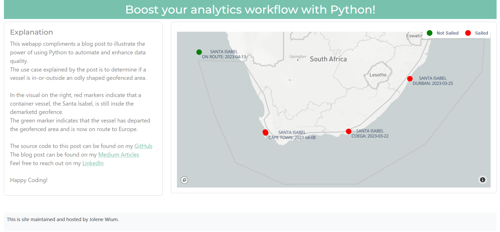

# Boost your analytics workflow with Python!
A Plotly Dash webapp to show the diversity of Python. This webapp compliments a blog post about using Python to automate repetitive tasks and enhance data quality.

